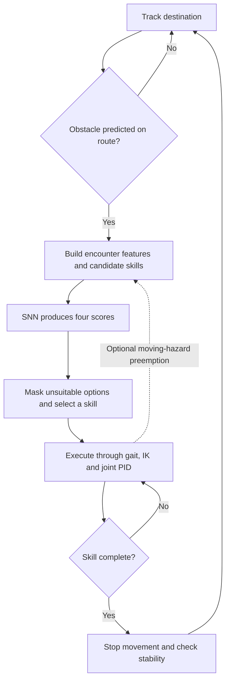

# Go2 project history: from classical walking to spiking skill selection

This document brings together the project’s motivation, development sequence,
current implementation, experiments, fixes and remaining work. It describes the
MuJoCo prototype developed in this workspace and the results recorded on
October 1, 2026, America/Denver. It is a development history, not a claim of
physical Go2 deployment.

## 1. What we set out to build

The original idea was to move a robot toward a destination with a simple
classical controller, use a neural network when an obstacle makes ordinary
travel unsuitable, choose a skill from a skill folder, and return to normal
travel after the obstacle is handled.

The supplied project proposal described a drone. During our discussion, the
project scope was explicitly changed to **the Unitree Go2 quadruped**, with
**MuJoCo simulation first**. A **spiking neural network (SNN)** was required
for the neuromorphic-computing aspect. The original proposal PDF was not edited.

The resulting architecture separates two responsibilities:

* Classical control supplies locomotion and joint stabilization.
* The SNN chooses which obstacle-handling behavior to execute.

An important refinement was that “return to PID” does not mean switching joint
PID off during avoidance. **Joint PID stays active throughout.** We change the
source of its motion targets—from the destination to a selected skill, then
back to the destination.

## 2. Where the repository started

The repository already provided the Menagerie Go2 model, MuJoCo scene files,
an indoor environment, and an evolving classical walking experiment. The
indoor scene contains connected rooms, a corridor, furniture and named task
sites. Standing in that scene and walking straight were useful foundations,
but neither was an obstacle-aware navigation system.

At the start of the policy research, the walking interface generated cyclic
foot motion and inverse-kinematics targets. The standalone walk skill created
a fresh simulation each time it was called. That meant simply calling one
standalone skill after another would not provide continuous control handoffs.

The work therefore had to add destination tracking, a persistent episode,
obstacle observations, skill selection, completion rules, and evidence that
the combined system actually worked in physics.

## 3. Research into already-trained Go2 policies

We first investigated published Go2 checkpoints and their deployment code.
The research covered candidates including:

| Candidate | Why it was relevant |
|---|---|
| `wty-yy/go2_rl_gym` | Published locomotion exports and a Python MuJoCo deployment path |
| `fan-ziqi/rl_sar` | Go2 policy packages, including robot_lab and HIMLoco, with companion configuration |
| `diasAiMaster/unitree-go2-velocity-flat` | An ONNX locomotion alternative |
| `JustinMLu/go2-parkour` | Parkour checkpoints with substantially more integration work |

The research distinguished published weights from policies actually reproduced
in our project. A checkpoint cannot be safely integrated merely by copying it
into a folder. Its joint order, observation layout, normalization, control
frequency, action scale, gains and robot model must match the runtime.

That led to the initial implementation decision: keep the classical gait as
the locomotion layer and train our own **skill-selection SNN**. This gives us
a working switching experiment without simultaneously solving pretrained
locomotion transfer.

**No external locomotion checkpoint has been downloaded and integrated into
this controller.** Our saved learned artifact is the selector, and its movement
skills are classical controllers. Source links, checkpoint details and
compatibility findings remain in the
[pretrained-policy research](docs/pretrained_policies_and_hybrid_control.md).
That research document marks its earlier repository inspection as historical.

## 4. Building location-to-location control

The next requested milestone was to move Go2 from one location to another.
We extended the walking foundation into a world-coordinate waypoint tracker.

The control chain is:

```text
Destination or waypoint
    → position and heading errors
    → desired body velocity
    → velocity slew and gait generator
    → foot targets
    → inverse kinematics
    → joint targets
    → joint torque PID
    → articulated Go2 physics
```

The high-level tracker uses proportional position and heading feedback.
The low-level joint controller is PID. This distinction matters: the robot
does not walk just because a PID sees a destination coordinate; the gait and
inverse kinematics connect that navigation request to its twelve joints.

The navigation controller supports a start position, initial heading, final
goal and intermediate waypoints. It turns, moves laterally as needed, and
settles at the destination. Tests include forward, sideways and behind-the-robot
goals, nonzero starts/headings, multiple waypoints, blocked routes and timeouts.

Several implementation details were important:

* The supplied MJX model’s affine position servos were converted to direct
  torque actuators before applying our torque PID. Torque must not be sent
  into an actuator input that still means a target angle.
* Velocity commands are slewed instead of changed abruptly at waypoint switches.
* The simple gait made poor progress with very small strides, so the tracker
  maintains a minimum moving command and uses a separate stopping decision.
* One simulation continues across waypoints. Only episode initialization places
  the robot at its specified start.

The relevant implementation is in
[walking control](controllers/walking.py),
[waypoint navigation](controllers/navigation.py), and
[the navigation entry point](skills/navigate.py).

## 5. Building the hybrid obstacle experiment

We introduced a separate, controlled arena for repeatable obstacle experiments.
The furnished indoor scene remains available, but the reported hybrid batches
use the simpler arena so that obstacle placement and motion can be varied and
compared systematically.

The arena contains a floor, boundary walls, start/goal markers and cylindrical
obstacles. Moving cylinders are MuJoCo mocap bodies following prescribed
trajectories. They can contact the robot, but the robot cannot push them away
from those trajectories.

We implemented three comparison modes:

| Mode | Behavior |
|---|---|
| `baseline` | Direct classical goal tracking, without obstacle-avoidance selection |
| `rules` | The same movement skills, selected by geometric decision rules |
| `snn` | The same movement skills, selected by the trained spiking network |

The rule mode provides the SNN’s demonstration teacher and a comparison that
uses the same skill library. The direct baseline is deliberately simple; it
is not a full classical path planner such as A* with a local controller.

### The skill folder

The four avoidance options are defined in [skills/avoidance.py](skills/avoidance.py):

| Skill | What it does |
|---|---|
| `bypass_left` | Generates a lateral waypoint and a waypoint beyond the obstacle |
| `bypass_right` | Generates the corresponding route on the other side |
| `wait` | Commands standing while a relevant obstacle clears |
| `back_off` | Targets a point 0.55 m away from the destination direction |

Left and right are relative to the goal direction. Back-off uses the waypoint
controller and may involve turning; it is not a separately trained backward gait.

These skills supply targets and termination conditions. They do not create,
reset or step their own simulations. Only the hybrid supervisor advances
physics and writes the motor commands.

## 6. How the current system works



### Observations and obstacle prediction

The current perception source is **simulator state**: obstacle positions,
radii and velocities are supplied directly. There is no camera or LiDAR
detector. Optional noise, delay and filtering can corrupt these observations
for controlled experiments; they do not turn this into a real perception system.

At 10 Hz, the threat detector considers the next 1.15 m of the goal ray and
seven constant-velocity obstacle predictions over three seconds. It uses a
0.42 m circular robot footprint and an additional threat margin. The prediction
uses observed velocity, not the obstacle script’s future stopping time.

Candidate-path geometry determines which skills are applicable. The SNN’s
highest-scoring allowed option is selected. An option with a high neural score
can still be rejected by this external geometric mask. If no option is allowed,
the episode reports failure.

### Persistent state and handoffs

The normal supervisor sequence is:

```text
BASELINE → SKILL → RECOVER → BASELINE → ... → COMPLETE
```

Failures enter `FAILED`. Joint PID remains active during all moving and standing
states. Physics, gait phase and command slew remain continuous at transitions;
stale PID integral error is cleared. Skills never teleport the robot.

Recovery lasts at least 0.8 s and requires a stopped gait, planar speed below
0.04 m/s, angular speed below 0.2 rad/s and tilt below 12°. Recovery times out
after five seconds if those conditions are not met.

Arrival requires distance within 12 cm, low planar speed and a stopped gait
for one second. A tighter 6 cm stopping trigger helps account for settling drift.

### Main timing and control parameters

| Parameter | Current setting |
|---|---|
| Physics and joint PID | 500 Hz; 2 ms timestep |
| Gait/joint-target update | 100 Hz |
| Obstacle sensing and trajectory logging | 10 Hz |
| Gait period | 0.6 s |
| Maximum commanded translation | 0.18 m/s |
| Maximum commanded yaw rate | 0.5 rad/s |
| Joint PID gains | Kp = 90, Ki = 3, Kd = 3 |
| Torque limit | At most 24 Nm, respecting lower model limits |

Commanded speed is not guaranteed measured speed. The torque loop uses
saturation, bounded integral contribution and anti-windup. Physics uses the
CPU implicit-fast integrator and 50 contact-solver iterations.

Contact, excessive tilt, low body height, timeouts and insufficient clearance
are failure conditions. The hybrid clearance guard stops an episode below
3.5 cm of observed footprint clearance. Stopping a simulation is an experiment
termination rule, not a guarantee of safety on a running physical robot.

## 7. The spiking neural network we trained

The selector is a genuine leaky integrate-and-fire network:

```text
12 observation features → 64 LIF neurons → 32 LIF neurons → 4 skill scores
```

Each decision runs for 16 internal encoding steps. Both hidden layers emit
binary spikes. Their membrane update uses decay 0.9, threshold 1 and an
immediate subtractive reset:

```text
membrane = 0.9 × membrane + input_current
spike = 1 if membrane ≥ 1, otherwise 0
membrane = membrane − spike
```

The first layer receives a constant normalized observation current. The second
receives first-layer spikes. A linear readout converts mean second-layer spike
counts into four scores. Scores are not probabilities. Membranes reset between
decisions, so the 16 steps are not 16 consecutive sensor frames or long-term
memory across encounters.

The twelve inputs are goal-relative obstacle position and velocity (four
values), obstacle radius, current clearance, left/right/back path clearances,
predicted waiting clearance, goal distance and heading error. Training-set
normalization is saved with the model; normalized inputs are clipped to ±5.

### Training method and saved artifact

We generated synthetic geometric encounters and labeled them using the rule
teacher. This is **supervised imitation learning**, not reinforcement learning.
Training used PyTorch, surrogate gradients for the binary threshold, weighted
cross entropy and Adam for 50 epochs. The best validation-agreement checkpoint
was exported for NumPy inference.

| Dataset or measurement | Value |
|---|---:|
| Training examples, seed 17 | 10,000 |
| Validation examples, seed 10017 | 2,000 |
| Test examples, seed 20017 | 2,000 |
| Best masked validation agreement | 98.10% |
| Masked test agreement | 98.25% |
| Unmasked test agreement | 97.50% |
| NumPy/PyTorch argmax agreement on first 100 test examples | 100% |

These percentages measure agreement with the teacher, not navigation success.
The exported runtime’s maximum score discrepancy on those 100 examples was
approximately 1.43e-6.

The saved files are:

* [model.npz](skills/policies/selector_snn/model.npz): trained weights and normalization.
* [manifest.json](skills/policies/selector_snn/manifest.json): architecture, schema, seeds, versions and checksum.
* [training.json](skills/policies/selector_snn/training.json): learning curve, confusion matrix and export checks.

Runtime inference needs NumPy, not PyTorch. The loader checks feature/action
ordering, parameter shapes and finite values, and loads without pickle.
No neuromorphic hardware or energy measurement was involved.


## 8. What testing taught us and what we changed

### First development runs

The first 72-episode development comparison used eight scenario families,
three seeds and three controller modes. Both hybrids succeeded in 24/24
episodes, while direct tracking succeeded in 8/24. These runs helped establish
the basic switching loop, but preceded the stronger stable-recovery check.
They are retained as development records, not merged into later validation totals.

### Friction was not initially being changed as intended

The first low-friction experiment changed the floor coefficient, but the
model’s priority-1 foot geometry overrode that floor setting at contact.
We corrected the foot defaults as well and tested the actual contact friction.
All nine low-friction episodes were rerun. The original low-friction rows are
explicitly excluded as evidence of low-friction behavior.

### Noise caused false clearance stops

We added reproducible position noise, velocity noise and delayed observation
snapshots. Some runs stopped even though the true robot-obstacle separation
was adequate: the noisy estimated clearance had crossed the stop threshold.

We then added optional motion-compensated exponential smoothing. The noise
configuration used 4 cm position standard deviation per axis, 0.01 m/s velocity
standard deviation per axis, 0.3 s delay and, when enabled, a 0.2 s filter time
constant. The filter was evaluated first on development seeds and then on new
seeds. Original failures remain in the report.

### A new obstacle could invalidate an executing skill

The `late_crossing` scenario places a static blocker ahead and moves a second
cylinder into the chosen bypass. Without replanning, the SNN failed all three
initial trials by stopping on clearance before contact. A good initial skill
choice was therefore insufficient for the whole maneuver.

This led to **optional active-skill preemption**, enabled with `--replan`.
The controller monitors moving hazards on the current skill segment and asks
the same frozen SNN for a fresh masked decision when the route becomes unsuitable.

This mode requires 0.2 s conflict confirmation after a one-second skill dwell,
uses observed speed above 0.025 m/s to identify moving hazards, extends waiting
to 60 s, and caps interventions at twelve. Waiting is associated with the
selected obstacle, so an unrelated static blocker does not prevent that wait
from finishing forever. Other blockers can prompt the next skill selection.

The resulting demonstrated sequence is:

```text
Bypass → another obstacle enters the route → preempt to wait
       → obstacle passes → stable recovery → fresh bypass → goal
```

This mode remains explicit rather than silently changing the earlier protocol.
It is local preemption, not a global time-dependent path planner.

### Runtime and environment fixes

We also made immediate viewer closure produce a valid, finite JSON failure
record, added observed-versus-true clearance diagnostics, and rejected invalid
PID timesteps. Tests cover saturation recovery and velocity damping.

The original `.venv` was a Linux/WSL environment. A separate `.venv-win` was
created for Windows execution instead of overwriting it. Later, a PowerShell
command pasted into WSL failed because Bash treats backslashes differently.
The corrected WSL command uses forward slashes and still launches Windows Python.

## 9. Measured results so far

The batches below have different purposes and protocols. Their denominators
should not be pooled into one universal success rate.

| Batch | Baseline | Rules | SNN |
|---|---:|---:|---:|
| Main held-out batch: eight families, seeds 100–104 | 18/40 | 40/40 | 40/40 |
| Noisy/delayed, unfiltered development | 6/18 | 16/18 | 14/18 |
| Same noisy development seeds, with filtering | 6/18 | 18/18 | 18/18 |
| Filtered noisy held-out batch, seeds 400–404 | 2/30 | 30/30 | 30/30 |
| Random goal direction and starting heading | 0/8 | 8/8 | 8/8 |
| Late-crossing, original mode, seeds 600–602 | 0/3 | 1/3 | 0/3 |
| Replanning on those known late-crossing seeds | 0/3 | 2/3 | 3/3 |
| Replanning on new late-crossing seeds 610–614 | 0/5 | 5/5 | 5/5 |
| Replanning with filtered noise, four families | Not rerun | 11/12 | 12/12 |

In the main batch, SNN final goal error averaged 6.46 cm. There were no SNN
contacts or falls, and the minimum sampled footprint clearance was 13.65 cm.
Additional stress covered approaching obstacles, a lateral push, corrected
low friction, angled goals and an impassable narrow passage. The impassable
passage remains a failure for all modes.

The final recorded test run passed **30 tests**. The notebook was validated
and executed, videos were decoded and visually inspected, and source/report
fingerprints were saved.

These results establish a working prototype under the tested conditions.
They do not establish general superiority of the SNN: the rule teacher matched
the main results, and the few replanning differences are a small targeted
sample. Clear trials repeat identical geometry across seeds. Waiting can also
take longer than direct tracking when a crossing would have been clear anyway.

The [validation report](docs/hybrid_validation.md) contains the full breakdown,
protocol caveats, failure cases and raw-record locations.


## 10. Where the implementation lives

| File or folder | Responsibility |
|---|---|
| `unitree_go2/` | Robot model, assets and scenes; included Menagerie license |
| `controllers/walking.py` | Torque actuator adaptation, joint PID, gait and leg IK |
| `controllers/navigation.py` | Body-velocity waypoint tracking and continuous gait state |
| `skills/walk.py`, `skills/navigate.py` | Standalone simulation entry points |
| `skills/avoidance.py` | Avoidance options and geometric clearance calculations |
| `skills/policies/selector_snn/` | Trained selector, manifest and training metrics |
| `hybrid/arena.py` | Scenario definitions, obstacle motion and contact detection |
| `hybrid/perception.py` | Encounter features, threat prediction, teacher and masks |
| `hybrid/sensing.py` | Optional noise, delay and filtering |
| `hybrid/snn.py` | NumPy LIF inference and spike diagnostics |
| `hybrid/train_selector.py` | Synthetic data generation, training and export |
| `hybrid/system.py` | Persistent physics loop, handoffs, optional preemption and termination |
| `hybrid/run.py`, `hybrid/evaluate.py` | Single runs and paired batch comparisons |
| `hybrid/plots.py`, `hybrid/recording.py` | Figures, spike rasters and MP4 recording |
| `configs/` | Editable scenario examples |
| `tests/` | Indoor, navigation, hybrid/SNN/sensing and PID regressions |

[Go2_hybrid.ipynb](Go2_hybrid.ipynb) is the main experiment notebook.
[Go2_runner.ipynb](Go2_runner.ipynb) retains the standalone walk workflow.
The [skill-folder guide](skills/README.md) explains the movement-skill contract.

Each hybrid run saves `summary.json`, `scenario.json`, `events.json` and
`trajectory.csv`. The records include choices, scores, applicability masks,
spikes, handoffs, contact/fall outcomes, final distance and runtime versions.
The summary records whether replanning was enabled. Reproduce that setting
with `--replan` as well as the saved scenario.

Raw runs, executed notebooks and videos are under `output/hybrid/`, which is
git-ignored. Selected figures and compact validation metadata are retained
under `docs/`. Ignoring output files does not remove them from this workspace.

## 11. How to run the current project

Run commands from the `Go2-Learning` project directory. The shell determines
which path syntax to use.

### From the WSL/Bash terminal shown in our discussion

```bash
cd "/mnt/c/Users/Raged Rhombus/Desktop/Projects/Go2-Learning"
./.venv-win/Scripts/python.exe -m hybrid.run --scenario late_crossing --replan
```

This deliberately invokes the installed **Windows** Python environment from
WSL, using Windows executable interoperability. It does not activate a Linux
virtual environment or install Linux dependencies.

### From Windows PowerShell

```powershell
cd "C:\Users\Raged Rhombus\Desktop\Projects\Go2-Learning"
.\.venv-win\Scripts\python.exe -m hybrid.run --scenario late_crossing --replan
```

### Useful variations, shown in WSL/Bash syntax

```bash
# Single moving obstacle or static bypass
./.venv-win/Scripts/python.exe -m hybrid.run --scenario crossing
./.venv-win/Scripts/python.exe -m hybrid.run --scenario static

# Run faster without opening a viewer; choose a separate output directory
./.venv-win/Scripts/python.exe -m hybrid.run --scenario late_crossing --replan --headless --output output/hybrid/my-run

# Compare direct tracking and the geometric teacher
./.venv-win/Scripts/python.exe -m hybrid.run --scenario static --mode baseline --headless
./.venv-win/Scripts/python.exe -m hybrid.run --scenario static --mode rules --headless

# Edit start, destination, obstacle motion and sensing settings
./.venv-win/Scripts/python.exe -m hybrid.run --config configs/hybrid_noisy.json

# All regression tests
./.venv-win/Scripts/python.exe -m unittest discover -s tests -v

# Paired comparison using the standard scenario families
./.venv-win/Scripts/python.exe -m hybrid.evaluate --seeds 100 101 102 --workers 3

# Retrain into a separate folder; preserve the delivered model
./.venv-win/Scripts/python.exe -m hybrid.train_selector --output output/hybrid/retrained
```

For notebook use, select `.venv-win`, run [Go2_hybrid.ipynb](Go2_hybrid.ipynb),
and change `SCENARIO`, `MODE`, `VIEWER` and `REPLAN` as needed. Set
`SCENARIO = "late_crossing"` and `REPLAN = True` for the preemption example.

Core simulation/inference dependencies are in `requirements.txt`. Training,
plotting, recording and notebook dependencies are in `requirements-experiments.txt`.
They are already installed in this checkout’s Windows environment. A failed
episode returns a nonzero CLI exit code; that can be an expected experiment result.

Saved examples are the [static bypass video](output/hybrid/demo-static.mp4),
[crossing video](output/hybrid/demo-crossing.mp4), and
[replanning video](output/hybrid/demo-replanning.mp4).

## 12. What we have not established yet

The current result is a flat-ground simulation prototype with a trained SNN
selector and classical movement skills. Important remaining boundaries are:

* Obstacle and robot-state information comes from the simulator. Noise tests
  still assume stable obstacle identities and known radii.
* The selector imitates geometric rules; it has not learned skill outcomes
  through reinforcement learning or physical trial and error.
* Local masks and optional preemption do not solve arbitrary mazes, dead ends,
  multi-obstacle encounters or hazards that arise while waiting.
* The training heading range is narrower than some executed maneuvers.
  More diverse held-out scenes and training data are needed.
* There are no jumping, climbing, stair or rough-terrain policies in this system.
* No real Go2, event camera or neuromorphic chip has been used. Spike counts
  and CPU inference timing do not establish an energy saving.
* Simulation termination and torque limits are not a hardware safety controller.

The next useful steps are broader route prediction and preemption tests,
sensor-derived perception, outcome-based skill selection, and a carefully
validated pretrained locomotion adapter. The existing experiment provides a
baseline and recorded failures against which those changes can be evaluated.

## 13. Supporting documents

* [Technical guide](docs/hybrid_system.md): control details, parameters and commands.
* [Validation report](docs/hybrid_validation.md): measured results and experimental limitations.
* [Validation metadata](docs/hybrid_validation_metrics.json): batch totals and fingerprints.
* [Pretrained-policy research](docs/pretrained_policies_and_hybrid_control.md): external candidates and compatibility analysis.
* [Replanning and remaining work](docs/hybrid_next_iteration.md): the optional implementation and further extensions.
* [Current project assessment](docs/project_status.md): concise component status.

This history records the progression from a locomotion foundation to destination
tracking, trained spiking skill selection, controlled evaluation, noisy sensing,
and optional replanning. The code, model metadata and experiment records are
the evidence behind the reported milestones.
