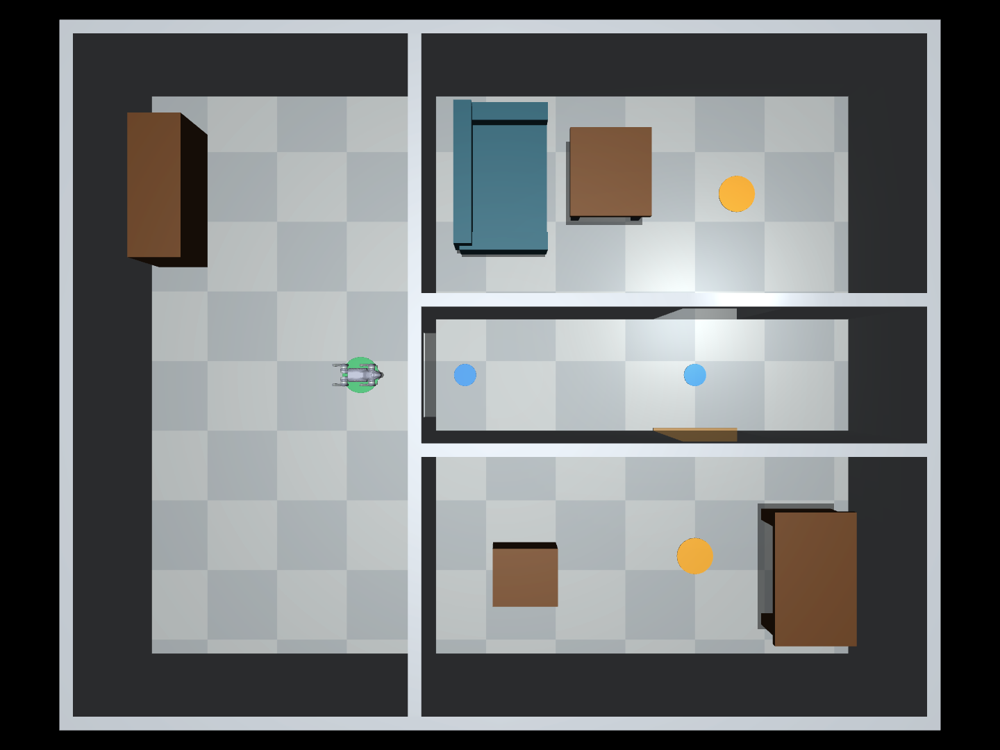

# Go2 MuJoCo Simulation

A project for simulating the Unitree Go2 quadruped in MuJoCo.

## Setup

1. Clone or download this repository.
2. Open a terminal in the project folder.
3. Create and activate a Python virtual environment for your operating system.
4. Install all dependencies:

   python -m pip install -r requirements.txt

5. Launch the simulation:

   python -m mujoco.viewer --mjcf unitree_go2/scene.xml

On macOS, use `mjpython` instead of `python` for the viewer command.

## Indoor environment

With the environment activated, run:

```sh
python indoor_demo.py
```

This loads `unitree_go2/scene_indoor.xml` and holds Go2 in its home posture
using a simple joint PD controller with actuator torque limits. It does not walk,
navigate, or implement the proposal's baseline navigation controller. On macOS,
use `mjpython indoor_demo.py`.



The 10 m x 8 m interior contains an entry room, a 1.6 m wide corridor,
a lounge with a sofa and table, and an office with a desk and box. Doorways
are 1.2 m wide and 2.1 m high. Walls are 2.4 m high; there is no ceiling so
the interior is visible from above. All furniture is fixed collision geometry.
The office doorway has a 2 cm threshold for a later step-crossing test.
Surface friction is a simulation starting value, not a measured floor material.

Green marks the start, blue marks intermediate waypoints, and yellow marks goals.
These are named MuJoCo sites with no collisions:

| Site | Position (x, y) in metres |
| --- | --- |
| `start` | (0, 0) |
| `waypoint_entry` | (1.5, 0) |
| `waypoint_corridor` | (4.8, 0) |
| `goal_lounge` | (5.4, 2.6) |
| `goal_office` | (4.8, -2.6) |

For the lounge route, travel along the corridor to (4.8, 0), turn through the
door to (4.8, 2.6), then approach the goal. For the office, turn south at
(4.8, 0). Markers define candidate tasks; no automatic task or reward logic exists yet.
Edit named geoms and sites in `scene_indoor.xml` to change the layout.
MJCF box `size` values are half extents. The original flat-ground and MJX scenes
remain available; this indoor scene uses the standard Go2 model.

To open the raw scene without the posture controller:

```sh
python -m mujoco.viewer --mjcf unitree_go2/scene_indoor.xml
```

The raw viewer does not supply standing torques, so the robot can collapse when
physics runs. For repeatable checks without a window:

```sh
python indoor_demo.py --headless
python -m unittest discover -s tests -v
```

Checks cover posture stability, collision response, and geometric clearance along
candidate routes. They do not demonstrate locomotion or navigation performance.
See [project assessment](docs/project_status.md) for progress against the proposal.

## Model source

The Go2 model is from [Google DeepMind's MuJoCo Menagerie](https://github.com/google-deepmind/mujoco_menagerie/tree/main/unitree_go2).
Its BSD-3-Clause license is included in `unitree_go2/LICENSE`.
