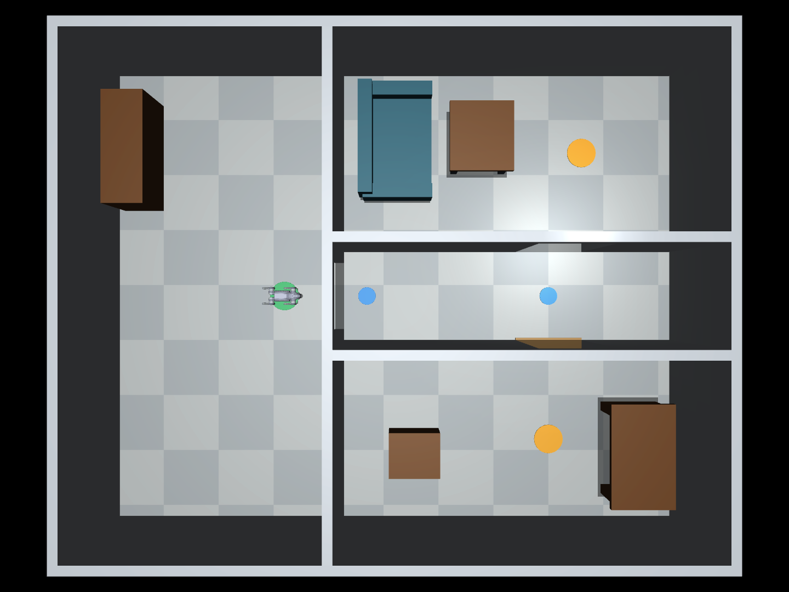

# Go2 MuJoCo Simulation

A project for simulating the Unitree Go2 quadruped in MuJoCo, with classical
goal tracking and a trained spiking network that selects obstacle-avoidance
skills. Start with **[Go2_hybrid.ipynb](Go2_hybrid.ipynb)** and the
[hybrid guide](docs/hybrid_system.md). See [measured results](docs/hybrid_validation.md)
for the baseline/rules/SNN comparison and known limitations.

For the full development story, architecture, experiments, fixes and run
instructions, see [Project history](PROJECT_HISTORY.md).

## Setup

1. Clone or download this repository.
2. Open a terminal in the project folder.
3. Create and activate a Python virtual environment for your operating system.
4. Install all dependencies:

   python -m pip install -r requirements.txt

5. Launch the simulation:

   python -m mujoco.viewer --mjcf unitree_go2/scene.xml

On macOS, use `mjpython` instead of `python` for the viewer command.

## Indoor environment

With the environment activated, run:

```sh
python indoor_demo.py
```

This loads `unitree_go2/scene_indoor.xml` and holds Go2 in its home posture
using a simple joint PD controller with actuator torque limits. It does not walk,
navigate, or implement the proposal's baseline navigation controller. On macOS,
use `mjpython indoor_demo.py`.



The 10 m x 8 m interior contains an entry room, a 1.6 m wide corridor,
a lounge with a sofa and table, and an office with a desk and box. Doorways
are 1.2 m wide and 2.1 m high. Walls are 2.4 m high; there is no ceiling so
the interior is visible from above. All furniture is fixed collision geometry.
The office doorway has a 2 cm threshold for a later step-crossing test.
Surface friction is a simulation starting value, not a measured floor material.

Green marks the start, blue marks intermediate waypoints, and yellow marks goals.
These are named MuJoCo sites with no collisions:

| Site | Position (x, y) in metres |
| --- | --- |
| `start` | (0, 0) |
| `waypoint_entry` | (1.5, 0) |
| `waypoint_corridor` | (4.8, 0) |
| `goal_lounge` | (5.4, 2.6) |
| `goal_office` | (4.8, -2.6) |

For the lounge route, travel along the corridor to (4.8, 0), turn through the
door to (4.8, 2.6), then approach the goal. For the office, turn south at
(4.8, 0). The waypoint controller below can execute specified routes; the
indoor posture demo itself does not execute a navigation task.
Edit named geoms and sites in `scene_indoor.xml` to change the layout.
MJCF box `size` values are half extents. The original flat-ground and MJX scenes
remain available; this indoor scene currently includes the MJX Go2 model.

To open the raw scene without the posture controller:

```sh
python -m mujoco.viewer --mjcf unitree_go2/scene_indoor.xml
```

The raw viewer does not supply standing torques, so the robot can collapse when
physics runs. For repeatable checks without a window:

```sh
python indoor_demo.py --headless
python -m unittest discover -s tests -v
```

Checks cover posture, collision response, waypoint navigation, SNN inference,
sensor stress models and hybrid handoffs. The original indoor checks alone
cover geometry and posture; the newer tests exercise locomotion and navigation.
See [project assessment](docs/project_status.md) for progress against the proposal.

## Model source

The Go2 model is from [Google DeepMind's MuJoCo Menagerie](https://github.com/google-deepmind/mujoco_menagerie/tree/main/unitree_go2).
Its BSD-3-Clause license is included in `unitree_go2/LICENSE`.

## Spiking obstacle-avoidance system

For the newer obstacle-avoidance experiment, open **`Go2_hybrid.ipynb`** or run:

```powershell
.\.venv-win\Scripts\python.exe -m hybrid.run --scenario crossing
```

The trained spiking network selects a bypass, wait or back-off skill, then
returns to classical goal tracking. Joint torque PID remains active throughout.
Use `--headless` for a fast run, `--scenario static` for a bypass, or
`--config configs/hybrid_example.json` to change start, destination and obstacles.
See [the hybrid guide](docs/hybrid_system.md) for setup, controls, retraining and
limitations, and [validation results](docs/hybrid_validation.md) for comparisons.
The SNN weights and metadata are saved under `skills/policies/selector_snn/`.
This is a simulation prototype with ground-truth obstacle sensing.

Experimental preemption handles a second moving obstacle entering an executing
bypass: `python -m hybrid.run --scenario late_crossing --replan`. Set
`REPLAN = True` in the notebook to enable the same behavior. This mode has
separate validation results and retains the simulator clearance stop.

## Saved walk skill

Open `Go2_runner.ipynb` from the project directory and choose **Run All**.
The viewer opens, Go2 stands for two seconds, then walks forward for ten seconds.
Close the viewer to stop early. You can also run:

```sh
python -m skills.walk
python -m skills.walk --duration 10 --headless
```

From Python or a notebook:

```python
from skills.walk import walk
history, summary = walk(duration=10, viewer=True)
```

The saved skill is `skills/walk.py`; the existing torque PID, foot trajectories,
and inverse kinematics live in `controllers/walking.py`. Each call creates a
fresh simulation. This is a straight-walking simulation experiment, without
speed/heading regulation, obstacle avoidance, or hardware support. For the
viewer on macOS, use `mjpython` instead of `python`.

## Move between locations

The classical navigation controller tracks world-frame `(x, y)` waypoints,
turns toward the direction of travel, and settles into a standing posture at
the final goal. It uses position/heading feedback, foot trajectories, inverse
kinematics and joint torque PID. No trained policy is required.

On this Windows checkout, use the separate Windows environment (the original
`.venv` was created under Linux/WSL):

```powershell
.\.venv-win\Scripts\python.exe -m skills.navigate --goal 1 0
```

If creating that environment on another machine:

```powershell
python -m venv .venv-win
.\.venv-win\Scripts\python.exe -m pip install -r requirements.txt
```

With an activated environment, run `python -m skills.navigate --goal 1 0`.
Add `--headless` to run without a window. Coordinates are metres; `--start-yaw`
is radians. A route through the corridor to the lounge is:

```powershell
.\.venv-win\Scripts\python.exe -m skills.navigate --goal 5.4 2.6 --waypoint 4.8 0 --waypoint 4.8 2.6 --timeout 240
```

From a notebook or Python:

```python
from skills.navigate import navigate
history, summary = navigate(goal=(1.0, 0.0), start=(0.0, 0.0))
print(summary)
```

Use `waypoints=[(x1, y1), (x2, y2)]` for intermediate locations. One simulation
continues through all waypoints; only the initial episode setup places the robot
at `start`. Arrival requires position within 12 cm, low speed, a stopped gait,
and one second of settling. The controller is deliberately slow and intended
for clear, flat routes. It does not plan around obstacles; contact with indoor
obstacles, excessive tilt/low height, or timeout returns `success=False`.
Obstacle contact is a failure detector, not predictive obstacle avoidance.

The command prints final position, distance, elapsed simulation time and stop
reason, and exits with a nonzero code on failure. The viewer closes at arrival
or failure; zero torque after the loop means physics has stopped, not an active
standing controller for hardware. Close the viewer to stop a run early.

Implementation: `controllers/navigation.py`; reusable entry point:
`skills/navigate.py`. Run checks with:

```powershell
.\.venv-win\Scripts\python.exe -m unittest discover -s tests -v
```
