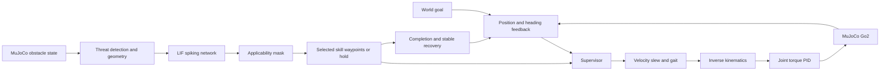

# Go2: goal tracking with a spiking skill selector

This experiment implements the project's requested Go2 version of the proposal:
drive toward a goal with a classical controller, detect an obstacle, let a
spiking neural network choose a movement skill, execute it, and resume goal
tracking. It runs real articulated Go2 physics in MuJoCo. The robot is placed
at its starting pose once; skills do not teleport the robot or reset physics.

The delivered network is trained and saved in
`skills/policies/selector_snn/model.npz`. It selects classical avoidance skills;
it is not a downloaded, pretrained locomotion policy. The existing walking
controller supplies locomotion. See [policy research](pretrained_policies_and_hybrid_control.md)
for external locomotion-policy candidates and their compatibility requirements.

## Run it

From the repository root on this Windows checkout:

```powershell
.\.venv-win\Scripts\python.exe -m hybrid.run --scenario crossing
```

This opens the MuJoCo viewer, stands for two simulated seconds, waits for a
moving cylinder to cross, then walks to the yellow goal. Closing the viewer
ends the episode. Use `--scenario static` to see a lateral bypass. Additional
scenarios: `clear`, `crossing_reverse`, `left_blocked`, `right_blocked`,
`narrow_crossing`, `push`, `head_on`, `blocked`, `low_friction`, `angled`,
`rotated_static` (random goal direction and starting heading), and
`late_crossing` (a second obstacle invalidates an executing bypass).
Some scenarios deliberately test failure behavior.

```powershell
# Fast simulation without a viewer
.\.venv-win\Scripts\python.exe -m hybrid.run --scenario static --headless

# Same scene with no avoidance, or with the demonstration teacher
.\.venv-win\Scripts\python.exe -m hybrid.run --scenario static --mode baseline --headless
.\.venv-win\Scripts\python.exe -m hybrid.run --scenario static --mode rules --headless

# Change start, destination and obstacles in a JSON file
.\.venv-win\Scripts\python.exe -m hybrid.run --config configs/hybrid_example.json

# Record a video at four times simulated speed
.\.venv-win\Scripts\python.exe -m hybrid.run --scenario static --headless --video output/hybrid/demo.mp4

# Experimental preemption when another moving obstacle enters a bypass
.\.venv-win\Scripts\python.exe -m hybrid.run --scenario late_crossing --replan
```

An unsuccessful episode exits with status 1. The default output directory is
`output/hybrid/latest`; use `--output` to retain separate runs. Each run saves
`scenario.json`, `summary.json`, `events.json`, and `trajectory.csv`. The event
log includes the actual SNN scores, applicability masks, observations, spikes,
and handoff times. Summary fields include contact, falls, distance, completion
time, torque, interventions, inference latency, model hash and runtime versions.
The final summary includes the terminal state even if failure happens between
trajectory samples. Trajectories are sampled at 10 Hz.

`Go2_hybrid.ipynb` provides the same workflow as editable notebook cells.
Select `.venv-win` as the Python environment. The core simulation and deployed
SNN need only `requirements.txt` (NumPy and MuJoCo). Retraining, plots and MP4
recording use `requirements-experiments.txt`; a notebook frontend may also
require the included `ipykernel`. Install those optional dependencies with:

```powershell
.\.venv-win\Scripts\python.exe -m pip install -r requirements-experiments.txt
```

No GPU is needed. These dependencies are already installed in this checkout.

## Control architecture



The high-level baseline is proportional position and heading feedback, capped
at 0.18 m/s commanded translation and 0.5 rad/s commanded yaw. These are command
limits, not guaranteed measured velocities. The simple gait maintains a
minimum nonzero stride when moving; the supervisor commands zero near arrival.
Body commands are slewed before generating a diagonal gait with a 0.6-second
period. Leg inverse kinematics produces joint targets at 100 Hz.

Joint PID runs every 2 ms:

`torque = clip(Kp*(q_target-q) + I + Kd*(v_target-v), -limit, limit)`

The default gains are Kp=90, Ki=3, Kd=3, with a bounded integral contribution
and conditional anti-windup. Torque is limited to 24 Nm or the model's lower
actuator limit. The supplied MJX model's position servos are converted to
direct torque actuators; applying PID torque to a position-servo input would
be incorrect. Contact solver iterations are increased to 50 and the CPU
integrator uses implicit-fast stepping.

Joint PID **continues during avoidance**. What switches is the source of the
motion target: the destination or the selected skill. Turning off joint control
while selecting a skill would remove support from the robot.

## Supervisor and skill contract

States are `BASELINE → SKILL → RECOVER → BASELINE`, ending in `COMPLETE` or
`FAILED`. Only `HybridSystem.run` steps physics and writes motor commands.
The gait phase, physical state and command slew persist through handoffs;
the joint PID's integral accumulator is cleared at transitions.

Obstacle observations are processed every 100 ms. The threat detector examines
the next 1.15 m of the goal ray and seven constant-velocity obstacle predictions
over three seconds, using a 0.42 m robot footprint plus a 0.10 m margin.
It does not know the future scripted stopping time. It is a local conservative
trigger, not a full route planner or time-optimal collision predictor.

The fixed skill ordering is part of the model schema:

| Index | Skill | Target/termination |
|---|---|---|
| 0 | `bypass_left` | Move laterally, then beyond the obstacle; within 14 cm of the final waypoint |
| 1 | `bypass_right` | Mirrored bypass; same completion rule |
| 2 | `wait` | Stand until the predicted goal route stays clear for 0.7 s |
| 3 | `back_off` | Move toward a point 0.55 m away from the goal; within 14 cm |

Left/right are relative to the goal direction, not global axes. The current
waypoint controller may turn to reach a back-off target; it is not a dedicated
backward gait. Bypass timeout is 100 s, wait 25 s and back-off 30 s.

Geometric masks reject candidate segments intersecting inflated cylinders or
arena walls. Waiting checks predicted clearance over three seconds. The SNN
produces four scores; the highest allowed score is selected. If none is allowed,
the run fails explicitly. These masks are external deterministic supervision,
not neural-network learning. Bypass masks check obstacle positions at selection
time; they do not certify an entire moving-obstacle maneuver.

Recovery commands zero motion for at least 0.8 s, then requires stopped gait,
planar speed below 0.04 m/s, angular speed below 0.2 rad/s, and tilt below 12°.
Failure to settle within five seconds ends the run. Arrival requires distance
within 12 cm, planar speed below 0.04 m/s and stopped gait for one second.
The tighter 6 cm stopping trigger reduces drift beyond the arrival radius.

Every physics step checks physical obstacle/wall contact, height below 15 cm,
tilt beyond 35°, and finite state. A geometric clearance below 3.5 cm stops
hybrid episodes. These are experiment termination rules, not a certified safety
controller: stopping the simulator prevents observing what would happen next.
On hardware, zeroing motor torque would not maintain a standing robot.

## Spiking network and training

The model has 12 inputs, 64 and 32 leaky integrate-and-fire (LIF) hidden neurons,
and four real-valued output scores. A decision uses 16 internal encoding steps.
For each hidden layer:

`u = 0.9*u + input_current; spike = (u >= 1); u = u - spike`

The first layer receives a constant normalized observation current. The second
layer receives first-layer binary spikes. A linear readout maps the mean
second-layer spike counts to skill scores. Membranes reset between decisions;
this is finite-window current encoding, not an event-camera input pipeline or
long-term memory across sensor frames. The raster plot shows actual binary
hidden activations, not a visualization of conventional ANN outputs.

Inputs are goal-relative obstacle position and velocity (four values), radius,
current clearance, three candidate path clearances, predicted waiting clearance,
goal distance and heading error. Normalization is fitted only to training data,
then clipped to ±5 standard deviations. The saved feature and skill names are
validated by the runtime to catch ordering mismatches.

Training uses 10,000 synthetic geometric encounters labeled by an explicit
heuristic teacher, 2,000 validation encounters, and 2,000 independent test
encounters (seeds 17, 10017, 20017). Training runs 50 epochs of weighted cross
entropy with Adam, backpropagation through the 16 steps and a smooth surrogate
derivative for the binary threshold. The highest validation-agreement weights
are exported as non-pickle NumPy arrays.

The delivered model achieved 98.25% masked test agreement and 97.5% unmasked
agreement with its teacher. This measures imitation, not obstacle-avoidance
success. The first 100 exported test predictions match PyTorch argmax exactly;
the maximum readout discrepancy was approximately 1.43e-6. Full metrics and the
confusion matrix are in `skills/policies/selector_snn/training.json`.

```powershell
# Writes a separate model without replacing the delivered weights
.\.venv-win\Scripts\python.exe -m hybrid.train_selector --output output/hybrid/retrained
.\.venv-win\Scripts\python.exe -m hybrid.run --headless --model output/hybrid/retrained/model.npz
```

The implementation follows the standard LIF/surrogate-gradient approach
explained in [snnTorch's training tutorial](https://snntorch.readthedocs.io/en/latest/tutorials/tutorial_5.html).
It implements those operations directly in PyTorch and NumPy; snnTorch is not
a dependency. CPU latency and spike fraction are recorded, but neither is a
measurement of neuromorphic energy use. There is no claimed energy saving or
performance advantage over the teacher.

## Experiments and next steps

```powershell
.\.venv-win\Scripts\python.exe -m hybrid.evaluate --seeds 100 101 102 103 104 --workers 3
.\.venv-win\Scripts\python.exe -m hybrid.plots --evaluation output/hybrid/evaluation
.\.venv-win\Scripts\python.exe -m hybrid.plots --run output/hybrid/latest --training
.\.venv-win\Scripts\python.exe -m unittest discover -s tests -v
```

Paired seeds give baseline, rule selector and SNN the same scenario. Clear runs
are deterministic and identical across seeds; do not treat those repetitions
as independent diverse environments. Validation results and failure cases are
reported separately in [hybrid validation](hybrid_validation.md).

Moving cylinders are kinematic mocap bodies with prescribed trajectories.
[MuJoCo's mocap documentation](https://mujoco.readthedocs.io/en/stable/XMLreference.html#body-mocap)
describes this mechanism. Contact can affect the robot but cannot push these
obstacles off their paths. The push scenario applies a 25 N lateral force for
0.2 s. Friction experiments change the priority-1 foot contact defaults as well
as the floor; changing the floor alone would not change the actual foot friction.

Optional sensing stress is available through `position_noise`, `velocity_noise`,
`sensor_delay`, `sensor_filter_tau` and `sensing_seed` in scenario JSON. Gaussian noise is added to
position and velocity snapshots, then snapshots are delayed; no future state
is exposed. At startup the first snapshot is held until the delay fills.
A positive `sensor_filter_tau` enables motion-compensated exponential smoothing
before buffering the observation. The default is zero (disabled). This filter
assumes persistent obstacle identities and measured velocities; it does not
perform object association or estimate velocities from images.
Threat detection, skill selection and clearance stops all use these imperfect
observations. Logged physical clearance and actual contact remain ground-truth
evaluation metrics. This is still simulated privileged sensing, not LiDAR.

```powershell
.\.venv-win\Scripts\python.exe -m hybrid.evaluate --scenarios static crossing head_on --seeds 300 301 302 --position-noise 0.04 --velocity-noise 0.01 --sensor-delay 0.3 --output output/hybrid/noisy
```

Current limitations are privileged obstacle positions/radii/velocities, circular
footprint approximations, flat floors, simple local options and a slow gait.
There is no camera/LiDAR processing, global planner, stair/jump skill, physical
Go2 deployment, event-sensor encoding or neuromorphic-hardware benchmark.
Repeated or novel hazards may invalidate a previously selected path. The
`late_crossing` stress test demonstrates this failure in the default mode.
The optional `--replan` mode adds moving-hazard preemption: a conflict on the
current skill segment must persist for 0.2 s, after a one-second skill dwell.
An observed speed above 0.025 m/s identifies a moving obstacle. A fresh masked
SNN selection replaces the current option without resetting physics. The
clearance guard remains active during dwell and confirmation. Waiting can last
up to 60 s in this mode and ends when the selected obstacle clears; other
obstacles can then cause another selection. A 12-intervention cap bounds loops.
This optional mode is separately evaluated and is not a complete global or
time-dependent planner. The SNN
inherits the teacher's limitations and may behave poorly outside its training
distribution. A blocked passage should remain a reported failure.

The next research step is sensor-derived perception and more diverse
held-out scenes, followed by outcome-based skill learning. A pretrained walking
policy can later replace the gait/IK block behind the same velocity interface,
after verifying its robot model, observation ordering, timestep, normalization,
joint ordering, action scale and checkpoint provenance. Its gains must not be
silently mixed with the present torque PID interface.

The reproducible late-obstacle failure, optional preemption implementation and
remaining work are described in [next iteration](hybrid_next_iteration.md).
