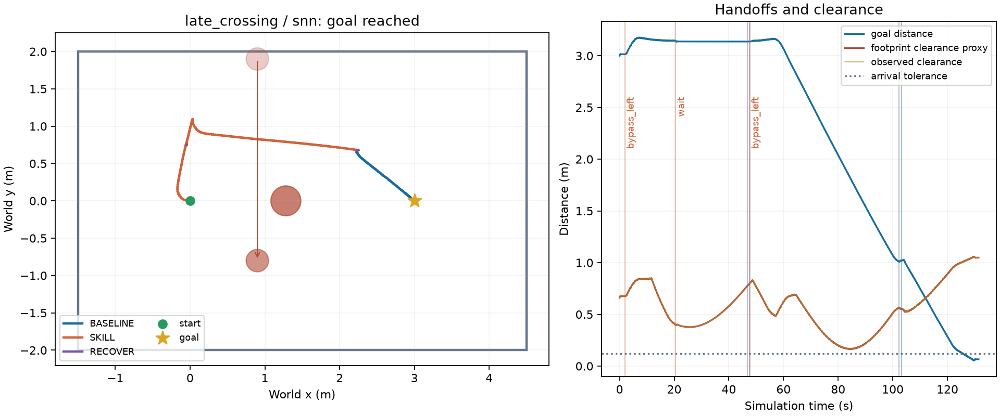
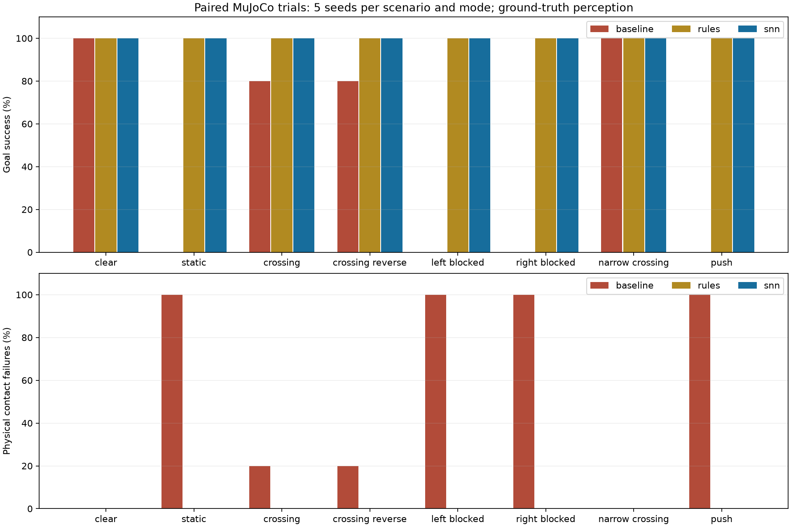
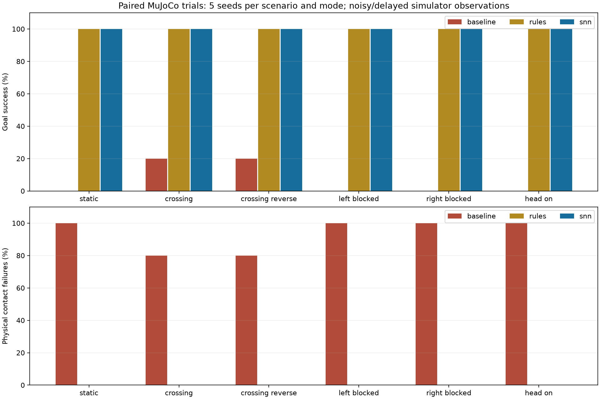
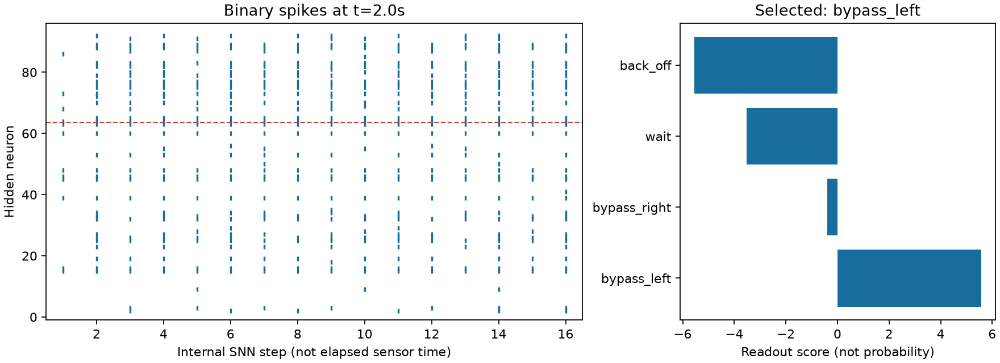
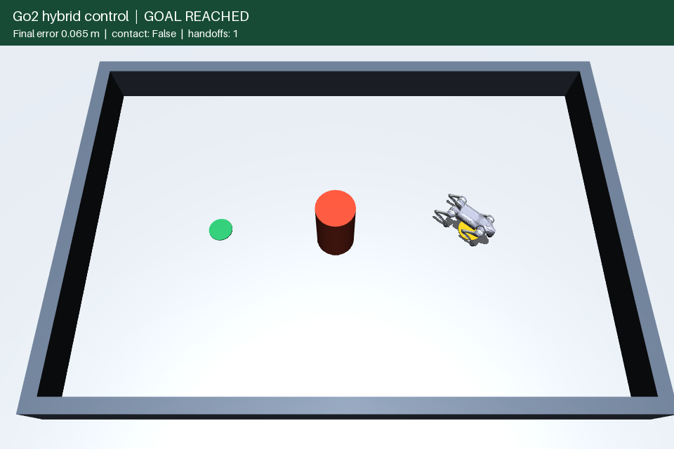

# Hybrid Go2 validation

Measured October 1, 2026 (America/Denver) in this Windows workspace.
Runtime: Python 3.14.7, MuJoCo 3.13.0, NumPy 2.5.3. Training used CPU
PyTorch 2.14.1. The simulator is stepped at 500 Hz, gait targets at 100 Hz,
and obstacle sensing at 10 Hz. No physical robot was used.

## Result that the current evidence supports

The prototype can execute **goal tracking → SNN-selected skill → stable
recovery → goal tracking** in persistent articulated Go2 physics. It passed
all 40 trials in the main held-out scenario batch. The geometric rule selector
also passed all 40. This demonstrates a working SNN implementation of the
selector, not a performance advantage over the rule teacher.

The comparison baseline is intentionally direct goal tracking without obstacle
avoidance. It is not a competitive classical planner such as A* plus a local
controller. Success over that baseline does not show that neural control is
necessary for this task.

## Main held-out simulation batch

Eight scenario families, seeds **100–104**, three modes: **120 episodes**.
These seeds were separate from development seeds 0–2. Cylinder radius and
placement/motion vary within modest ranges; these are not arbitrary buildings.
The clear scenario is identical across seeds, and some scenario families share
geometry. The 40 trials should not be treated as 40 independent real-world
environments or as proof of a 100% population success rate.

| Scenario | Baseline successes | Rule successes | SNN successes | Mean SNN completion, simulated s |
|---|---:|---:|---:|---:|
| Clear | 5/5 | 5/5 | 5/5 | 64.04 |
| Static blocker | 0/5 | 5/5 | 5/5 | 96.48 |
| Crossing | 4/5 | 5/5 | 5/5 | 87.26 |
| Reverse crossing | 4/5 | 5/5 | 5/5 | 87.26 |
| Left route blocked | 0/5 | 5/5 | 5/5 | 99.08 |
| Right route blocked | 0/5 | 5/5 | 5/5 | 98.84 |
| Narrow crossing | 5/5 | 5/5 | 5/5 | 84.52 |
| Lateral push | 0/5 | 5/5 | 5/5 | 98.86 |
| **Total** | **18/40** | **40/40** | **40/40** | **89.54** |

Baseline had 22 obstacle-contact failures; neither hybrid mode had contact or
fall failures. SNN final goal error was 6.30–6.67 cm (mean 6.46 cm), below the
12 cm arrival threshold. The minimum sampled circular-footprint clearance
across SNN runs was 13.65 cm; maximum recorded joint torque was 21.39 Nm.
The mean per-episode SNN inference mean, excluding clear runs with no inference,
was approximately 0.246 ms on this machine under concurrent batch load.
This is neither a real-time deadline guarantee nor a hardware energy metric.

The SNN's highest-scoring action was allowed in every main-batch selection,
so no mask override occurred. The masks remain necessary guard logic; this
batch does not establish that removing them would be safe.

Waiting is conservative: several crossing trials were already traversable by
the direct baseline, which completed in 64.04 s. The hybrid controller waited
and took longer. In the push family, baseline contact occurred before the
scheduled push at 28 s, so its failures cannot be attributed to the push.
The hybrids did experience the 25 N, 0.2 s lateral force.

Raw records: `output/hybrid/holdout/evaluation.json`, `results.csv`, and `runs/`.
The latter contains every scenario, event stream and sampled trajectory.

## Additional geometry and dynamics stress

Seeds **200–202**, with three trials per scenario and controller:

| Scenario | Baseline | Rules | SNN | Interpretation |
|---|---:|---:|---:|---|
| Approaching obstacle, then stops | 0/3 | 3/3 | 3/3 | Back-off and subsequent bypass; SNN completion roughly 141 s |
| Impassable narrow passage | 0/3 | 0/3 | 0/3 | Baseline contacts; both hybrids terminate on geometric clearance |
| Low friction, coefficient 0.25 | 0/3 | 3/3 | 3/3 | Actual foot contact coefficient checked in a regression test |
| Angled goal and initial heading | 0/3 | 3/3 | 3/3 | Limited heading/goal variation succeeds |

The first low-friction experiment only changed the floor, whose contact
parameters were overridden by priority-1 foot geoms. Those original numbers
are **invalid as a low-friction test**. The foot defaults were corrected and
all nine low-friction episodes were rerun in `output/hybrid/friction-corrected/`.
The corrected SNN times were 73.04, 73.64 and 72.34 s. The faster progress is
a property of this simple gait/contact setup; it does not imply lower friction
is generally beneficial. Use the corrected records, not the low-friction rows
in the older `output/hybrid/stress/` batch.

The blocked-passage runs remain failures. Stopping the simulator before
contact is not equivalent to maintaining safety on a running physical robot.
This prototype lacks a global planner to report or solve arbitrary dead ends.

Two additional checks probe behavior beyond the main goal direction:

* `rotated_static`, seeds **500–507**: independently sampled goal direction
  and initial robot heading in a square arena. Baseline had 0/8 successes;
  rules and SNN each had **8/8**, without contact or falls. SNN completion
  ranged from 95.24 to 105.34 simulated seconds.
* `late_crossing`, seeds **600–602**: a second cylinder enters a bypass that
  was clear when selected. Baseline had 0/3 successes, rules **1/3**, and SNN
  **0/3**. All failed hybrid episodes ended on clearance, before physical
  contact. **The default mode does not replan an executing skill when a new
  obstacle invalidates its route.** This motivated the separately evaluated
  optional mode below; the original failures remain part of the record.

Records are under `output/hybrid/rotated/` and `output/hybrid/late-crossing/`.

## Optional active-skill replanning

The subsequent `--replan` implementation predicts moving-obstacle conflicts
on the current skill segment, requires 0.2 s confirmation after a one-second
skill dwell, and asks the same frozen SNN for a replacement option. Physics
and gait state persist. It additionally uses obstacle-specific wait completion,
a longer 60 s wait timeout, and a 12-intervention cap. These changes define a
separate protocol; improvements cannot be attributed to the SNN alone.

| Replanning batch | Baseline | Rules | SNN |
|---|---:|---:|---:|
| Known late-crossing seeds 600–602 | 0/3 | 2/3 | 3/3 |
| New late-crossing seeds 610–614 | 0/5 | 5/5 | 5/5 |
| Filtered noisy seeds 700–702, four scenarios | Not rerun | 11/12 | 12/12 |

The noisy batch uses static, crossing, head-on and late-crossing scenarios,
with the same 4 cm position noise, 0.01 m/s velocity noise, 0.3 s delay and
0.2 s filter as earlier. Both remaining rule failures (clean seed 602 and
noisy late-crossing seed 701) were clearance stops. SNN runs in these batches
had no contacts or falls. The clean SNN late-crossing episodes completed in
131.14–133.54 s. In the recorded seed-600 demo the sequence is bypass →
preempt to wait → stable recovery → fresh bypass → goal, with one preemption.

This is a small targeted result, not a statistical superiority claim or a
general collision-free planner. Preemption only monitors moving hazards on
the current segment, and noisy velocity thresholds, dwell times, new hazards
during waiting, or global dead ends remain limitations. The default stays
unchanged so earlier experiments remain reproducible. Use `--replan` explicitly
or set `REPLAN = True` in the notebook.

Records: `output/hybrid/replanning/`, `output/hybrid/replanning-noisy/` and
`output/hybrid/demo-replanning/`; video: `output/hybrid/demo-replanning.mp4`.

## Noisy and delayed sensing

Sensor stress adds independent Gaussian position noise with 4 cm standard
deviation per axis, velocity noise of 0.01 m/s per axis and a 0.3 s observation
delay. Stable obstacle identities and exact radii are still provided. Robot
pose remains ground truth. This is a limited simulated observation model.

Development seeds **300–302** cover static, crossing, reverse crossing,
left/right blocked and approaching-obstacle scenarios: 18 trials per mode.

| Sensor setting | Baseline | Rules | SNN |
|---|---:|---:|---:|
| Noisy/delayed, unfiltered | 6/18 | 16/18 | 14/18 |
| Same seeds, optional 0.2 s smoothing | 6/18 | 18/18 | 18/18 |

The four unfiltered SNN failures were clearance stops, with no physical
contact or falls. The minimum true sampled footprint clearance across those
18 SNN episodes was 9.44 cm. Noisy measurements can falsely trigger the more
conservative observed-clearance stop. The SNN also made different selections
from the teacher in approaching-obstacle encounters. A back-off can produce
headings outside the synthetic training range (±0.3 rad), an additional
distribution-shift concern.

Motion-compensated exponential smoothing was added after observing these
failures. Its 18/18 result uses the same development seeds and is not an
independent validation of the filter. No model weights were changed during
these sensor experiments.

The separate filtered batch used seeds **400–404**, the same six scenario
families, and **90 episodes**. Baseline completed **2/30** with 28 contact
failures; rules and SNN each completed **30/30**, with no contacts or falls.
The smallest true sampled SNN footprint clearance was 10.70 cm. These
results support the chosen filter under this particular modest noise model;
they do not validate real perception, dropped detections or adversarial noise.
Records are under `output/hybrid/noisy-holdout/`.

## SNN training and export

| Item | Measured value |
|---|---:|
| Training / validation / test examples | 10,000 / 2,000 / 2,000 |
| Masked validation agreement, best epoch | 98.10% |
| Masked independent test agreement | 98.25% |
| Unmasked independent test agreement | 97.50% |
| NumPy/PyTorch argmax agreement, first 100 test examples | 100% |
| Maximum score discrepancy on those 100 | 1.43e-6 |

These are teacher-label agreement metrics, not navigation success rates.
Hidden layers emit binary spikes and use leaky membranes with reset; the
output scores themselves are real-valued. Training is supervised imitation
with surrogate gradients, not reinforcement learning. The observation window
uses constant-current encoding; no event camera or neuromorphic chip was used.

Model SHA-256:
`207e70715604b887a0c19b2177ebba31587b5759aaea2d11db9b48dea9c5dc6a`.
Weights, feature/action order, data seeds and versions are preserved in
`skills/policies/selector_snn/`. Full training curves and the confusion matrix
are in `training.json`.

## Software and artifact checks

All **30 regression checks passed in the final full-suite run** (44.36 s),
including closing the viewer before the first physics step. They cover
physical waypoint navigation, collision outcomes, stable handoff velocities,
no trajectory jumps, model checksum, actual binary spikes, finite input checks,
segment geometry, delayed observations, deterministic noise, filtering error,
successful optional preemption without a trajectory jump, scenario loading,
actual low-friction contact parameters, PID saturation
recovery, velocity damping and invalid PID timestep rejection. The early-exit
fix keeps the summary JSON finite and serializable when a viewer is closed
immediately. The final run is recorded in `output/hybrid/tests-final.log`.

`Go2_hybrid.ipynb` was schema-validated and every cell executed successfully
with the Windows virtual environment. An executed copy is retained in
`output/hybrid/Go2_hybrid.executed.ipynb`. Offscreen MuJoCo demos were recorded
and frames visually inspected. Runtime plots show trajectories, handoffs,
clearance, and the actual SNN decision raster.

Compact batch totals and hashes of raw reports are retained in
`docs/hybrid_validation_metrics.json`, along with a source-file fingerprint
snapshot after validation. Raw trajectories and videos are in the git-ignored
`output/` folder. The code and saved selector weights are sufficient to rerun
the experiments; the report figures are retained in `docs/figures/`.

For reproduction commands and parameter meanings, see [hybrid system](hybrid_system.md).
The early 72-episode development batch in `output/hybrid/development/` predates
the stronger stable-recovery gate and is not included in the main totals.
