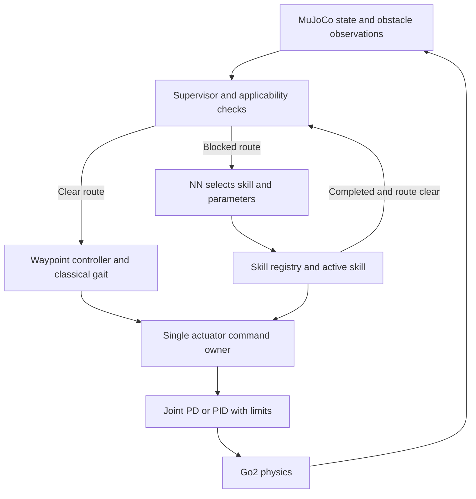

# Go2 pretrained policies and PID/NN skill switching

Research date: October 1, 2026. Target: this project's MuJoCo simulation first, as confirmed by the user.

**Implementation update:** the project now has a working classical navigation
controller and a trained spiking skill selector. See [hybrid system](hybrid_system.md)
and [validation](hybrid_validation.md). The repository inspection below records
the earlier research state; it is not the current implementation status.
No external locomotion checkpoint has been downloaded or integrated.

## Recommendation

The proposed system is feasible: use a classical gait controller for ordinary travel, detect a blocked route, let a small neural network select an applicable skill, execute it until a defined completion condition, and return to ordinary travel. The difficult parts are making locomotion reliable and transferring control between behaviors without destabilizing the robot.

Start by evaluating **wty-yy/go2_rl_gym** and **rl_sar's Go2 robot_lab policy**. Both publish Go2 weights with deployment code/configuration. Use a frozen, velocity-conditioned locomotion policy to implement several obstacle-avoidance skills through different commands. Add terrain-crossing policies after the indoor avoidance system works. Do not begin by assembling unrelated jumping, crawling, and walking networks and assuming they can be switched interchangeably.

There are two different PID layers to distinguish:

- **Navigation feedback:** position/heading error produces a desired body velocity.
- **Joint feedback:** desired joint angles/velocities produce motor torques.

An NN that outputs joint targets normally still uses joint PD underneath. Switching to that NN does not mean turning off all feedback control. Our proposed system switches the producer of locomotion targets and pauses ordinary navigation; a single actuator controller remains responsible for motor commands.

This document contains research and a proposed implementation design. No downloaded policy has been executed or validated in this project, and no weights or runtime controllers were installed in this research pass.

## What the project currently has

Inspection of the current working files, rather than only their README, found:

| Component | Current behavior | Consequence |
| --- | --- | --- |
| `controllers/walking.py` | `JointPID` has torque saturation and integral anti-windup; `WalkingExperiment` generates foot trajectories and solves IK | Useful classical baseline, but not a complete navigation controller |
| `skills/walk.py` | Creates a new experiment and resets the robot for every call | Cannot chain skills in a continuous episode yet |
| `WalkingExperiment.targets()` | Forward cyclic stepping, with standing/single-leg-step alternatives | No commanded lateral velocity, heading feedback, or obstacle avoidance |
| `unitree_go2/scene_indoor.xml` | Actually includes `go2_mjx.xml` | Some existing README descriptions of the scene's model are stale |
| `go2_mjx.xml` | Position-like affine actuators with force limits; joint, IMU, and world-frame sensors | A policy adapter must distinguish angles from torques |
| `WalkingExperiment.__init__()` | Converts these actuators to direct torque input and changes solver settings | Reusing its modified model requires an external joint controller |
| `requirements.txt` | MuJoCo/NumPy/viewer dependencies | No Torch or ONNX inference dependency recorded |

Current actuator order is FL, FR, RL, RR, with hip/thigh/calf within each leg. Sensor declaration order is not identical to actuator order. Use names to map observations and actions; never assume raw sensor slices match the policy.

The current gains are `kp=90`, `ki=3`, `kd=3`; these are not transferable defaults for pretrained policies. The experiment limits torque to at most 24 Nm. A policy trained with different gains or limits can behave differently even when its robot geometry matches.

A one-second headless smoke run was attempted through `.venv/Scripts/python.exe`. It failed before importing the project because the virtual environment references `/usr/bin/python3.14`. Therefore this report does not claim that the current baseline was run successfully. Establish the intended Windows or WSL environment before benchmarking; do not overwrite an environment being used elsewhere without checking.

## Where to get already-trained Go2 policies

“Published weights” below means an actual file listing or artifact endpoint was checked. It does **not** mean performance has been reproduced. Repository and model-card claims are identified separately from our recommendations.

### 1. wty-yy/go2_rl_gym — first candidate for the MuJoCo integration

The project provides Go2 locomotion models, a Python MuJoCo deployment runner, and published evaluation results. Its model collection contains TorchScript and ONNX exports. One concrete package is `go2_moe_cts_137000_0.6713/{policy.pt,policy.onnx}`. It also publishes a self-collision-enabled model family; older table entries were trained with self-collision disabled. These are locomotion policies, not a ready-made indoor skill selector. [Code and deployment instructions](https://github.com/wty-yy/go2_rl_gym), [weight collection](https://huggingface.co/wty-yy/go2_rl_gym_data), [specific exported files](https://huggingface.co/wty-yy/go2_rl_gym_data/tree/main/go2_moe_cts_137000_0.6713).

The inspected runner supports outputs that include both actions and MoE diagnostics, rather than always returning a single tensor. Its config specifies 45 observations, 12 actions, 2 ms physics steps and ten-step decimation, yielding 50 Hz inference; PD gains are 20 and 0.5. Preserve the exact export's output signature and matching configuration. Internal MoE experts are not automatically named skills like “jump” or “turn left.” [Runner](https://github.com/wty-yy/go2_rl_gym/blob/30e74dc507bec7a642a8c98be26081f2c6f0822d/deploy/deploy_mujoco/deploy_go2.py), [configuration](https://github.com/wty-yy/go2_rl_gym/blob/30e74dc507bec7a642a8c98be26081f2c6f0822d/deploy/deploy_mujoco/configs/go2.yaml).

**Our assessment:** best starting point for reproducing an existing Python MuJoCo example before adapting to the indoor scene. Published scores are benchmarks from that project, not success probabilities for ours. Pin the model and configuration together; a current default may reference a different checkpoint.

### 2. fan-ziqi/rl_sar — compact Go2 policy packages

Two concrete Go2 packages are present:

| Package | Weights | Companion files | Why consider it |
| --- | --- | --- | --- |
| robot_lab | `policy/go2/robot_lab/policy.pt`, 769,376 bytes in Git | Its `config.yaml` and `policy/go2/base.yaml` | Simpler observation contract without external observation history |
| HIMLoco | `policy/go2/himloco/himloco.pt`, 991,615 bytes in Git | Its `config.yaml` and the base config | Alternative locomotion controller using observation history |

The framework lists Go2 support for MuJoCo and hardware. The current project is primarily C++; its README directs Python users to an older version. For our Python project, adapt the inference contract instead of importing the entire ROS/C++ framework. [Framework](https://github.com/fan-ziqi/rl_sar), [robot_lab files](https://github.com/fan-ziqi/rl_sar/tree/376d42c9b128f963ab08579762d5a216a976ce39/policy/go2/robot_lab), [HIMLoco files](https://github.com/fan-ziqi/rl_sar/tree/376d42c9b128f963ab08579762d5a216a976ce39/policy/go2/himloco).

The robot_lab config orders its 45 observations as angular velocity, projected gravity, commands, relative joint positions, joint velocities and previous actions. HIMLoco starts with commands and lists six history frames; merely passing the same 45-element vector to both is wrong. Their PD gains are respectively 20/0.5 and 40/1. Their action scaling is also per joint: hip scale 0.125 and thigh/calf scale 0.25. [robot_lab contract](https://raw.githubusercontent.com/fan-ziqi/rl_sar/376d42c9b128f963ab08579762d5a216a976ce39/policy/go2/robot_lab/config.yaml), [HIMLoco contract](https://raw.githubusercontent.com/fan-ziqi/rl_sar/376d42c9b128f963ab08579762d5a216a976ce39/policy/go2/himloco/config.yaml).

**Our assessment:** robot_lab is a good second candidate or a first adapter exercise. Neither package establishes obstacle perception or an autonomous route around furniture.

### 3. diasAiMaster/unitree-go2-velocity-flat — ONNX alternative

The public model includes `policy.onnx`, external weights `policy.onnx.data`, `model_500.pt`, and `params/deploy.yaml`. The model card identifies flat-ground velocity tracking, trained using Unitree RL Mjlab. It explicitly requires its own deployment config: action scale 0.5 and no gait-phase observation. The deployment file specifies a 20 ms policy period. [Model card](https://huggingface.co/diasAiMaster/unitree-go2-velocity-flat), [files](https://huggingface.co/diasAiMaster/unitree-go2-velocity-flat/tree/9a723b7ab0784cd86abb942836aa1f208ddde891), [deployment config](https://huggingface.co/diasAiMaster/unitree-go2-velocity-flat/blob/9a723b7ab0784cd86abb942836aa1f208ddde891/params/deploy.yaml).

**Our assessment:** useful if choosing ONNX Runtime for a small Python inference adapter. Keep both ONNX files together. It is a flat-ground candidate, not evidence of stair climbing. Reproduce its model-specific observation scaling, default pose and gains rather than the latest upstream defaults. Its documented task names differ from the current upstream README, reinforcing the need to pin versions.

### 4. JustinMLu/go2-parkour — available parkour weights, substantial integration work

Published folders include `parkour_v12_ft_i` and `parkour_v12_ft_iii`, each with `policy.pt`, `adaptation_module.pt`, `estimator.pt`, and `scan_encoder.pt`. These files use Git LFS: a 130-byte Git blob is a pointer, not the neural network. The `ft_iii` policy's actual LFS endpoint returned HTTP 200 and length 1,959,954 bytes. The configuration describes 52 proprioceptive features, a ten-frame history buffer and 132 scan observations. [Files](https://github.com/JustinMLu/go2-parkour/tree/1a51607672d7c2dbf9d7fc95b7a42e03b714e739/deploy/networks/go2), [configuration](https://github.com/JustinMLu/go2-parkour/blob/1a51607672d7c2dbf9d7fc95b7a42e03b714e739/deploy/configs/go2.yaml).

The inspected deployment code loads a scan text file and switches between zero scans and a phase-synchronized replay triggered by a button. It does not obtain live obstacle geometry in this path. All four networks and their preprocessing are needed. [Deployment code](https://github.com/JustinMLu/go2-parkour/blob/1a51607672d7c2dbf9d7fc95b7a42e03b714e739/deploy/base/deploy_base.py), [instructions](https://github.com/JustinMLu/go2-parkour).

**Our assessment:** a useful later research candidate. Replace prerecorded scans with correctly sampled MuJoCo terrain observations, reproduce its reference scene, then test applicability to new obstacles. A successful replay is not autonomous obstacle handling.

### 5. Other published checkpoints worth distinguishing

| Source | What is published | Fit for this project |
| --- | --- | --- |
| [Eurekaverse Go2 seed 2](https://huggingface.co/beshy3752/eurekaverse-go2-parkour-seed2) | `model_11000.pt`, configuration pickle, terrain and benchmark files; privileged terrain-scan teacher | Experimental parkour candidate. Requires original network/environment contract and terrain scans, not a standalone MuJoCo policy. A MuJoCo teacher port would need equivalent scans; the model card recommends distillation for deployment. |
| [SAC Go2 MuJoCo](https://huggingface.co/cagataydev/sac-unitree-go2-mujoco) | `best/best_model.zip`; model card specifies 37 observations and 12 torque actions | Forward-walking comparison. Direct torque outputs require a different adapter; it is not demonstrated as a command-conditioned turn/sidestep controller. |
| [RAMBO Go2 reproduction](https://huggingface.co/dontKnow23456/rambo-go2-policies) | Quadruped/biped training checkpoints and configuration | Coupled to RAMBO/Isaac Lab/model-based control, not a drop-in locomotion actor. Model card states CC BY-NC 4.0. Low priority for this task. |

These are maintainer-reported capabilities. The Eurekaverse and SAC benchmarks were not reproduced here. Do not compare reward numbers across unrelated environments.

### 6. Useful references that are not verified ready-to-use Go2 skill packs

- **Unitree RL Gym:** supports Go2 training, but the inspected `deploy/pre_train` directory contains G1/H1/H1_2. It is not the Go2 weight source to use here. [Directory](https://github.com/unitreerobotics/unitree_rl_gym/tree/main/deploy/pre_train).
- **Unitree RL Mjlab:** current official MuJoCo-based training/deployment framework with Go2 support. Useful if fine-tuning becomes necessary; the inspected Go2 deployment tree did not supply an ONNX model. [Repository](https://github.com/unitreerobotics/unitree_rl_mjlab).
- **Robot Parkour Learning:** skill learning/distillation and Go2 configuration/deployment examples. The public top-level checkpoint directory is named `go1_ckpts`; Go1 weights should not be relabeled as Go2 weights. [Repository](https://github.com/ZiwenZhuang/parkour).
- **Extreme Parkour:** important visual-locomotion training methodology; the inspected repository describes training/export rather than a verified plug-in Go2 checkpoint pack. [Repository](https://github.com/chengxuxin/extreme-parkour).
- **Macmachi/go2-rl:** offers locomotion and hierarchical LiDAR-navigation training code, but its README explicitly excludes checkpoints from Git. It is a design reference, not a weights download. [Repository](https://github.com/Macmachi/go2-rl).
- **real-jiashu-yu/parkour-drl-checkpoints:** search indexed Go2 reproduction checkpoints, but the linked code repository returned 404 during verification. Treat as an unresolved lead until the matching code and model contract are accessible. [Model listing](https://huggingface.co/real-jiashu-yu/parkour-drl-checkpoints).

## How classical control can move Go2

For a joint, a conventional controller is:

```text
error = q_desired - q
torque = clip(Kp*error + Kd*(dq_desired-dq) + Ki*integral(error) + torque_ff)
```

PD is the `Ki=0` case. This tracks a trajectory; it does not create a balanced sequence of footsteps. Joint feedback and gait generation are separate problems. [Modern Robotics, joint torque control](https://modernrobotics.northwestern.edu/nu-gm-book-resource/11-4-motion-control-with-torque-or-force-inputs-part-1-of-3/).

For the classical baseline, extend the current pipeline as follows:

```text
waypoints -> position/heading feedback -> vx, vy, yaw_rate
          -> gait phase + foot placement + body stabilization
          -> inverse kinematics -> desired joint states -> joint PID -> torques
```

A practical first outer controller uses body-frame waypoint error: rotate the world-frame position error by inverse yaw, apply bounded proportional gains to x/y error, and use wrapped heading error for yaw rate. Add integral action only where persistent bias warrants it, with saturation and anti-windup. Limit velocity and acceleration to the gait's measured operating range. To rotate, stance/swing foot motions must account for the commanded yaw rate; setting a yaw variable alone does not change the present straight gait.

For better balance, foot placement and body roll/pitch correction need feedback, not just periodic IK targets. CHAMP illustrates a classical pattern/impedance approach; Quad-SDK and MIT Cheetah software offer more elaborate model-based control references. Porting them is a larger project than extending our baseline. [CHAMP](https://github.com/chvmp/champ), [Quad-SDK](https://github.com/robomechanics/quad-sdk), [Cheetah Software](https://github.com/mit-biomimetics/Cheetah-Software).

For learned position-target policies, use their trained convention:

```text
action = frozen_policy(exact_observation)
q_desired = default_pose + action_scale * action
torque = clip(Kp_policy*(q_desired-q) - Kd_policy*dq)
```

Do not automatically add the existing integral term or finite-difference target velocity: many source policies expect zero desired joint velocity and no integral term. A direct-torque policy follows a separate action path and must not be interpreted as joint angles.

In MuJoCo, `data.ctrl` means what the model's actuator definition says. In the untouched MJX model it acts as a servo target; after our experiment's conversion it is torque. Applying PD externally and also retaining an unintended built-in servo changes the control law. [MuJoCo actuation model](https://mujoco.readthedocs.io/en/stable/computation/index.html#actuation-model).

## Proposed switching architecture

The following is our design proposal, not a prevalidated controller from any cited repository.



Use one `MjModel`, one `MjData`, and one physics loop for the episode. A skill advances within that loop; it does not launch a viewer, sleep, reset the robot, or own a second simulation.

Initial skill set:

| Skill | Implementation | Completion example |
| --- | --- | --- |
| turn_left / turn_right | Validated velocity policy with bounded yaw command | Reach a selected clear heading |
| sidestep_left / sidestep_right | Same policy with lateral velocity command | Reach a local free-space subgoal |
| back_up | Same policy with reverse command, after checking rear clearance | Reach a retreat subgoal |
| stop_and_wait | Validated standing/zero-velocity behavior | Route becomes clear, or timeout |
| step_over_low | Separate validated terrain behavior, added later | Entire robot has crossed and regained stable support |

The first five can share one set of weights. They are different closed-loop behaviors, not necessarily separately trained networks. A low threshold may already be traversable by the ordinary gait; determine this experimentally rather than invoking a jump because an obstacle was detected. Furniture avoidance and jumping onto platforms are different tasks.

### Detecting and representing obstacles

Begin with simulated range observations using `mj_ray`/`mj_multiRay`. Exclude all robot geometry with geom-group filtering, retain static walls/furniture, normalize ray directions, and handle the no-hit result explicitly. Excluding only the base body is insufficient to remove every leg. [MuJoCo ray API](https://mujoco.readthedocs.io/en/stable/APIreference/APIfunctions.html#mj-ray).

For floor-level avoidance, a proposed starting input is 36-72 horizontal range sectors, local goal direction/distance, body velocity, gravity/tilt, active skill and elapsed skill time. Add multiple ray heights or depth/elevation observations for low thresholds, overhead obstacles and gaps. One horizontal scan cannot reliably determine whether to jump, crawl, or step down.

Account for the swept body and foot envelope, not only distance from the base center. Trigger intervention before contact. A starting stopping-distance model is `d_trigger = v*T_delay + v^2/(2*a_brake) + margin`, with braking deceleration and margin measured in simulation. This is a design approximation, not a guarantee. Use a larger exit-clearance threshold than entry threshold and require persistent clearance to avoid rapid switching.

### Supervisor states and return to PID

Use `BASELINE -> PREPARE -> SKILL -> SETTLE -> BASELINE`, plus `STOP/FAILED`.

1. **BASELINE:** follow waypoints with the classical gait. Detect blocked swept paths, loss of progress or excessive instability.
2. **PREPARE:** request a feasible skill and local subgoal, reduce speed when appropriate, and verify its starting conditions. A dynamic jumping skill may require a particular approach speed rather than stopping.
3. **SKILL:** keep the selection active until completion, timeout, or an overriding failure. Continue monitoring every physics step. Do not choose a different gait at every NN update.
4. **SETTLE:** require stable support, acceptable body rates/tilt, and clearance for the intended continuation path. A jump is not complete merely because its front feet passed the obstacle.
5. **BASELINE:** replan or advance the waypoint from the current pose, initialize gait phase for the measured contact state, reset/freeze old PID integrals and derivative history, and resume with bounded commands.

Do not resume a straight command that immediately points back into the same obstacle. If no skill is applicable, hold/stop or request a new route. A corner or U-shaped trap can require route memory and a planner; a purely local selector is not guaranteed to escape it.

Blend targets only between compatible support states, and test the blend. Averaging two stable gait actions does not establish that their average is stable. Match gains, action histories and policy hidden state during handoff. For phase-dependent policies, enforce initiation conditions instead of blindly interpolating a jump.

Suggested initial scheduling: physics and joint feedback every 2 ms, policy inference every 20 ms when that matches the checkpoint, navigation/obstacle processing at 10-20 Hz, and selector decisions at 5-10 Hz or on option termination. These are proposed starting rates; source policies with different timing need their own adapters. Physics-step failure checks remain active between NN decisions.

## Training the selector NN

The closest conceptual model is an **option**: a behavior with initiation conditions, an internal policy and a termination condition. This directly describes a skill folder better than a collection of unbounded functions. [Options framework](https://www.sciencedirect.com/science/article/pii/S0004370299000521). ANYmal Parkour supplies a research precedent for a high-level policy selecting locomotion skills, though its weights and robot are not Go2 replacements. [ANYmal Parkour](https://arxiv.org/abs/2306.14874).

Freeze validated low-level skills initially. Train the small selector separately. A proposed first model is an MLP with two 128-unit hidden layers producing skill scores; a second output may predict bounded heading/displacement/speed parameters. Start with discrete parameter bins if continuous outputs complicate training. A temporal encoder is appropriate when moving obstacles or hidden geometry make single-frame inputs insufficient.

Two practical training approaches:

- **Supervised selection first:** sample obstacle encounters in MuJoCo, clone full episode state, roll out each applicable skill, and label the successful behavior with the lowest chosen cost. State cloning must include controller histories, gait phases and RNG state, not only `qpos`. Predict success/cost per skill when multiple choices are valid. Collect additional examples where the learned selector disagrees with the rollout teacher.
- **Hierarchical RL afterward:** keep skills frozen and train the selector for route progress, successful completion, collision/fall avoidance, time and excessive switching. If options have variable duration, account for elapsed steps in discounted returns (for example a continuation discount `gamma^k`). Do not treat a two-second behavior as having the same elapsed time as a one-step action.

Both approaches need explicit skill applicability masks. Examples: rear clearance before reversing; enough lateral space before sidestepping; obstacle height/width and landing space within a tested traversal envelope before stepping or jumping. NN confidence alone is not a reliable fallback condition. Combine validation of observations, conservative applicability checks, timeout/no-progress detection and a stop option.

Use randomized starts, obstacle dimensions, friction, pushes and sensing noise. Split entire layouts and obstacle arrangements between training and evaluation; adjacent frames from one trajectory are not independent test data. Simulator geometry can label training examples, but if the deployed selector receives scans, avoid giving it hidden map labels at evaluation and calling that sensor-based navigation.

## Packaging policies under skills/

Proposed structure, not created runtime functionality:

```text
skills/
  walk.py                       existing public demo wrapper
  registry.py                   future skill discovery and applicability
  velocity_skills.py            future turn/sidestep/reverse options
  policies/
    go2_velocity/
      policy.pt                 OR policy.onnx plus external data
      source_config.yaml
      manifest.json
      LICENSE
      validation.json
    go2_parkour/                 only after its adapter is validated
      policy.pt
      adaptation_module.pt
      estimator.pt
      scan_encoder.pt
      source_config.yaml
      manifest.json
```

Each manifest should record: upstream URL and immutable revision; file SHA-256 values; license/provenance; robot/model variant; inference backend; exact observation terms/order/units/scales; history order and reset rules; joint names/order; action type/scale/clipping; default pose; gains and torque limits; expected control period; auxiliary networks; supported command range; initiation/termination conditions; and actual local validation results. An untested download should be marked disabled/unvalidated.

A proposed skill interface is `can_enter(state, terrain)`, `enter(context)`, `step(observation, dt)`, `status()` and `exit(reason)`. Return a typed command containing joint position/velocity targets, gains and optional feedforward torque. Reserve a separately typed command for direct-torque policies. Exactly one arbiter writes `data.ctrl`.

Record advertised licensing without assuming a repository license resolves every upstream asset: rl_sar advertises Apache-2.0, the diasAiMaster model card BSD-3-Clause, wty-yy's model card MIT, and RAMBO's card noncommercial CC BY-NC 4.0. Preserve source notices with imported assets.

### Reproducible acquisition records

| Source | Revision checked | Files to acquire together |
| --- | --- | --- |
| fan-ziqi/rl_sar | `376d42c9b128f963ab08579762d5a216a976ce39` | Chosen Go2 `.pt`, its `config.yaml`, base config, license, relevant inference implementation |
| wty-yy/go2_rl_gym | `30e74dc507bec7a642a8c98be26081f2c6f0822d` | MuJoCo runner, matching config/model definition and license |
| wty-yy/go2_rl_gym_data | `b9cd72d5046358b4ca6840a3d795d001402e6bfc` | Chosen export folder; map it explicitly to the correct code/config version |
| diasAiMaster/unitree-go2-velocity-flat | `9a723b7ab0784cd86abb942836aa1f208ddde891` | Both ONNX files, `params/deploy.yaml`, model card and training configuration |
| JustinMLu/go2-parkour | `1a51607672d7c2dbf9d7fc95b7a42e03b714e739` | Four networks for one variant, config, preprocessing and model definition |
| unitreerobotics/unitree_rl_mjlab | `1425b15f73bd4095f0df53709d7c389c3eb9e790` | Framework reference; not an assertion of compatibility with the older community ONNX export |

These are source revision identifiers, not local model checksums. We checked GitHub trees, public model listings and one parkour LFS endpoint; we did not download or deserialize the neural networks. GitHub LFS artifacts require actual LFS downloads, and ONNX exports with external data require the sidecar file. Treat training checkpoints, TorchScript files and ONNX graphs as distinct formats even if several filenames end in `.pt`.

## Implementation and evaluation sequence

1. **Reproduce locomotion.** Resolve the Python environment, run the existing baseline and one source policy in its matching model/scene. Measure standing, forward/backward commands, turning, lateral movement and stopping. Do not assume all command directions work because the input has three components.
2. **Build the persistent episode loop.** Separate observation collection, gait/skill stepping, actuator control and rendering. Preserve the notebook/demo entry point as a wrapper. Verify no pose reset or second controller write occurs during transitions.
3. **Implement obstacle sensing and deterministic selection.** Demonstrate baseline-to-skill-to-baseline behavior around a box before training an NN. This provides a teacher, a benchmark and a way to isolate failures.
4. **Train the selector on frozen skills.** Use simulated rollout labels, then optionally hierarchical RL. Include failed choices and no-feasible-skill examples. Reevaluate after adding every new skill.
5. **Add low-threshold traversal.** Test the existing 2 cm doorway threshold first. Add progressively harder steps with explicit bounds. Introduce jump/crawl only when observations and transition handling support them.
6. **Evaluate on unseen layouts.** Compare classical baseline, deterministic selector and NN selector using the same skills, starts, goals and random seeds. Add an always-on learned locomotion comparison if useful, labeling it separately from the classical baseline.

Report goal completion rate, collision and fall rates, minimum clearance, time to goal, path length, intervention count, skill success, transition failure rate, return-to-baseline success, torque saturation and inference latency. Separate wall/furniture impacts from intended foot-ground contacts. Evaluate both individual skills and complete routes; individually successful skills can still fail when composed.

Proposed acceptance gates are behavioral rather than an invented success percentage: no reset at handoff, correct joint/action mapping, correct inference timing, successful repeated recovery to route tracking, and a documented operating envelope across held-out trials. Set numerical targets before experiments and report uncertainty across seeds/trials. Add ablations for history, hysteresis and state initialization to discover whether the NN or the switching logic explains improvements.

For this project, the first useful demonstration is: **classical walk toward a waypoint -> detect a blocking box -> NN chooses a validated turn/sidestep/retreat behavior -> reach a clear local subgoal -> reinitialize classical gait -> continue toward the waypoint**. It demonstrates the requested idea without depending on an unverified parkour transfer.
